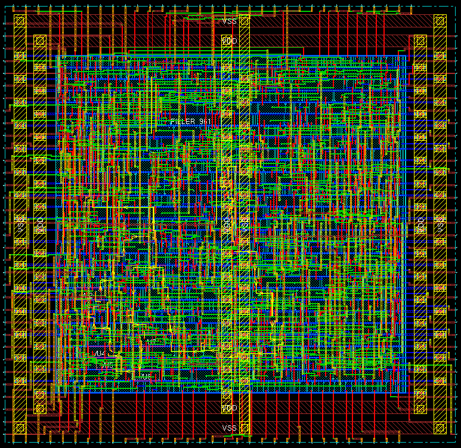

# vlsi_project

This is a template for the digital VLSI design project. It contains a complete
design flow for an N-bit digital divider. The project includes 2 folders:
- `divder`: the main folder of the design project
- `document`: the useful PDF documents to understand the project

## Prerequisite: Linux development environment
It is very important for users to get familiar with the Linux development
environment, because people always work on Linux instead of Windows in the
digital circuit domain. At least, you should be able to know some basic
operations in Linux, such as:
- `ls`: list all the files in the current folder
- `cd`: change the working directory to a new location
- `cp`: copy the specified file to a new location
- `mv`: move the specified file to a new location
- `mkdir`: create a new directory in the specified location
- `rm`: remove a specified file or a specified directory
- `chmod`: change the access permission to the specified files
- `less` or `more`: view the content of a specified file
- `find`: find the specified files or directories under a specified location
- `grep`: find the specified pattern in the contents of files
- `tar`: compress or un-compress of files into or from an archive
- `history`: check the command line history you have used before

There is a more detailed explanation called `linux_command.pdf` under
the `document` directory. You can find more detailed information there if you
are not familiar with the Linux environment.

## Design project: N-bit divider
The main part of the design project (N-bit divider) is included in the `divider`
folder. The `divider` folder contains different directories serving for
different design stages of digital design flow:
- `rtl`: the folder containing all Verilog/VHDL/SystemVerilog source codes
- `behav_sim`: conduct the behavior simulation of the digital design
- `syn`: run the synthesis flow in this directory
- `syn_sim`: conduct the gate-level simulation of the post-synthesis results
- `layout`: run the place and route (P&R) in this directory
- `layout_sim`: conduct the gate-level simulation of the post-layout results

## Step 0: Tool chain setup
In the sampled project, we will use the following tools for our VLSI design:
- Synopsys VCS: RTL behavior simulation, post-synthesis simulation, and
  post-layout simulation.
- Synopsys Design Compiler: RTL synthesis.
- Cadence Encounter Digital Implementation: place and route.

In order to launch the software properly, we should activate the running
environment for each software on our server. The software can be enabled on UST
server as follows:
- Synopsys VCS: 
  > source /usr/eelocal/synopsys/vcs_mx-vi2014.03-2/.cshrc
- Synopsys Design Compiler:
  > source /usr/eelocal/synopsys/syn-vi2013.12-sp5-5/.cshrc
- Cadence Encounter Digital Implementation:
  > source /usr/eelocal/cadence/edi142/.cshrc

You can also append all these settings to your local `.cshrc` file so that you do
not need to type it each time when you log in your system. Concretely, type the
following shell commands in the terminal:

```sh
echo "source /usr/eelocal/synopsys/vcs_mx-vi2014.03-2/.cshrc" >> ~/.cshrc
echo "source /usr/eelocal/synopsys/syn-vi2013.12-sp5-5/.cshrc" >> ~/.cshrc
echo "source /usr/eelocal/cadence/edi142/.cshrc" >> ~/.cshrc

```

## Step 1: RTL design
In `rtl` directory, we have provided a skeleton of the RTL design of an N-bit
divider. Since the divider is a small module for a digital design project, there
is only one file (`divider.v`) under this directory. In a real design, there may
exist tens to hundreds of Verilog files in it.

The provided `divider.v` is not complete. You have to read the structure of the
source code and complete the `TODO` section in the `divider.v`. A supplementary
document `divider.pdf` can be found under the `document` folder, which gives a
great explanation of how a divider works in hardware. Basically, the division is
conducted in a trail-and-error scheme, where the divisor is subtracted from the
most significant bit (MSB) to the least significant bit (LSB) of the dividend
iteratively. The quotient will be shifted in 1 or 0 depends on whether the
subtraction result is positive or negative. The divisor operation is different
from the simple add or multiplication operation, where it takes multiple clock
cycles to give the final results of the division. For instance, it requires 33
clock cycles for a 32-bit divider to generate the final quotient and remainder.
Additional `done` signal will be asserted (i.e. raised to logic 1) to notify the
outside world when the division is complete.

## Step 2: Behavior simulation
After the RTL design is finished, we should run the behavior simulation to not
only check there is no syntax error with our design, but also the functionality
and timing of the design is correct. We will run the behavior simulation in the
`behav_sim` directory. We provide the testbench code for our design, i.e.
`divider_tb.v`. It is highly recommended to check the content of the testbench
to see how the input stimulus are applied to the inputs of the divider.
Moreover, there exists two simple shell scripts under `behav_sim` directory:

- `run`: compile the source code and testbench of the divider using Synopsys VCS
- `clean`: clean the intermediated files generated by Synopsys VCS

It is suggested to read the content of these 2 scripts and to understand how to
include the Verilog source codes to the VCS command.

In order to launch the VCS compilation and simulation, you only have to type the
following 2 commands in your terminal:

  > ./run

  > ./simv -gui

The DVE GUI will be launched, and you are able to run the simulation and view
the waveform. The usage of DVE GUI is very simple, you can simply drag the
wires you want to inspect and add them into the waveform window. It is very
similar to the Windows software. In addition, the testbench will print the
division results to your terminal (a.k.a console). If the RTL design is correct
in Step 1, you should be able to see the following division results in the
terminal:

```sh
10 / 7: quotient = 1, remainder = 3
100 / 100: quotient = 1, remainder = 0
100 / 7: quotient = 14, remainder = 2
100 / 0: quotient = 0, remainder = 0
70 / 150: quotient = 0, remainder = 70
```

## Step 3: Synthesize the design using Synopsys Design Compiler
After the divider passes the behavior simulation, we can go to the next digital
design stage: synthesis. We will run the synthesis in the `syn` directory.
Initially, there exists 4 files under the `syn` directory:

- `run`: the simple shell script launching the Synsopsys Design Compiler to run
  the synthesis
- `clean`: the simple shell script removing the generated results by the
  Synopsys Design Compiler
- `run.tcl`: the main TCL script to run the whole synthesis flow
- `divider.constraints.tcl`: the TCL script containing the design constraints,
  including time constraint and environment constraint

The provided `run.tcl` script uses an Open Source standard cell library, called
Nangate FreePDK 45nm. It can be freely accessed
[here](http://www.nangate.com/?page_id=2325) after the registration.
You are recommended to use a different standard cell library if you are right
now working on some projects using the commercial library such as TSMC 65nm
or UMC 45nm.

Before you run the synthesis for the divider, you must modify the TCL script
`run.tcl`, which defines the library path to the Nangate FreePDK 45nm. More
specifically, the standard cell library is stored on the following path in my
system:

```sh
/mnt/hgfs/PDK/NangateOpenCellLibrary_PDKv1_3_v2010_12/
```

As a result, the `search_path` includes that directory. You have to modify the
`search_path` accordingly based on your system settings. Of note, the Design
Compiler requires the binary format of the standard cell library (\*.db) instead
of readable ASCII format (\*.lib). For Nangate FreePDK, only the ASCII format is
provided. Thereby, you need compile it into the binary format. Luckily, Design
Compiler provides a companied tool to do this task, called `Library Compiler`.
You can find the procedure to do the compilation from \*.lib to \*.db
[here](https://www.utdallas.edu/~akshay.sridharan/index_files/Page6049.htm).

In order to run the synthesis flow of the design project, you only need to type
the following command in the terminal:

  > ./run

If the settings are correct, you will observe 2 directories have been generated
under the current directory:

- `results`: the synthesized results, including gate-level netlist, Design
  Compiler binary file (\*.ddc), constraint file (\*.sdc), and delay file
(\*.sdf)
- `reports`: the reports of the synthesized results, including area, power and
  timing reports of the design

It is suggested to closely read the generated reports and synthesized
gate-level netlist.

### Step 4. Post-synthesis simulation
The gate-level simulation of post-synthesis should be conducted under `post_syn`
directory. In this step, you should first copy the synthesized results from Step
3. More specifically, the netlist (\*.mapped.v) and the delay file (\*.sdf) are
needed to be copied from `syn` directory to the current directory. A sampled
synthesized netlist and delay file are already included in this folder in case
you fail to write the HDL design of the divider or do the synthesis. You should
replace the sampled files with your synthesized results here. In addition, a
modified testbench `divider_tb.v` is also included in this directory. The
testbench contains the additional SDF back-annotation part as follows:

```verilog
initial begin
  $sdf_annotate("your_sdf_filename.sdf", your_instantiate_module);
end
```

Similar to the behavior simulation in Step 2, 2 handy shell scripts are provided
to compile the simulation of synthesized netlist and clean the simulation. The
`run` script for post-synthesis simulation should include the verilog behavior
model of standard cell. Therefore, we need pass the behavior model to the VCS
compilation. You should modify the file path to the verilog behavior model in
`run` script. If your setting is correct, you can run the compilation and
simulation as in Step 2:

  > ./run

  > ./simv -gui

In the waveform of post-synthesis simulation, you should observe the latency as
well as glitches. But the calculated results of each division should be the same
as the behavior simulation. The results can be conveniently observed from the
console of DVE.

### Step 5. Place and route (P&R)
P&R takes the synthesized netlist from Step 3, and generates the final layouts
for your design. In this step, we follow the flow of official EDI tutorial
called `EDI13.1workshoplab1.pdf` in `document` directory. In the workshop, a
LEON processor is placed and routed. The design flow is similar to the steps
provided by the official workshop. The main differences of P&R with the official
workshop are listed as follows:

- Standard cell library: EDI official workshop uses Cadence FreePDK 45nm. In the
  sampled project, we are using Nangate FreePDK 45nm. You can also pick any
commercial standard cell library.
- Design complexity: the LEON processor in EDI offiical workshop is more
  complex than the simple divider module. For example, there exists 4 memory
MACROs in LEON processor. Therefore, in the floorplan section in official
workshop, 4 MACROs will be placed in the chip. However, the divider does not
contain the memory MACRO. These floorplan steps can be skipped. But it is highly
recommended to go through the floorplan section of the official workshop to
understand the role of floorplan for the complex VLSI chip design.

For design import step, the sampled `mmc.view` is included in `scripts`
directory for your reference. As before, the file path of Nangate FreePDK should
be varied on your system. You should modify the content of `mmc.view` to cater
for your system settings. It is recommended to understand how we define the
fast corner for hold time analysis and the slow corner for setup time analysis
in `mmc.view`. Generally speaking, the fast corner includes the fast corner
timing library (\*.lib), fast corner RC library (\*.capTbl), and different
scaling factors for RC extraction. In addition, the abstract view of standard
cell layout (\*.lef) needs to be specified during the design import. You can
refer to `divider.globals` in the `scripts` folder to understand which lef files
are imported in the design.

During the power plan step, the width of power ring and the number of stripes
can be decreased since the divider is much simpler than the LEON processor (less
power hungry).

Of note, the Nangate FreePDK does not provide QRC technology file. It only
provides the capacitance table file. Therefore, in the final step of post-route
timing and SI optimization, we are not able to set the RC extraction effort
level to medium. As a compromise, we set the extraction level to *low* here.
Keep in mind that in a commercial standard cell library, the foundry will
always provide you with the QRC technology file. 

On UST server, we provide the compiled QRC technology file from NCSU FreePDK
45nm. It is possible for you to include the QRC file when you import the design.
A new version of `mmc2.view` is provided for your reference to include the
technology file as well as SI library file (\*.cdb). As before the data path of
library needs to be modified accordingly based on your system.

After the post-route timing and SI optimization are conducted, 2 additional
files are required for the later post-layout simulation:

- divider.sdf: SDF annotation file for the delay backannotation.
- divider.v: verilog file of the P&R netlist.

These two files can be generated as follows:

- divider.sdf: the method to generate the SDF file has been described in
  `Extracting RC Data` section of the provided EDI workshop. However, SDF file
is generated after detail routing here. Therefore, we will *deselect* the `Ideal
Clock` because the clock tree has been synthesized.
- divider.v: the netlist can be generated by typing the following command in EDI
  console:
  > saveNetlist divider.v

### Step 5b. Script-based P&R (update)
In order to simplify the P&R flow of simple design, which does not have many
hierarchies and memory MACROs. I update a sampled script named `top.tcl` under
directory `divider/layout/top.tcl`. It should be noted that in order to make the
script work, you should modify the library path accordingly in `top.tcl` and
`mmc2.view`. Similarly, to run the script-based P&R, two handy shell scripts,
`run` and `clean` are provided. More specifically, to run the P&R of
the divider, you can type the following command in the terminal:

  > ./run

Three important directories will be generated:

- `db`: checkpoints for the divider during different stages for doing P&R,
  including floorplan, power plan, place, CTS, and post-route. You can restore
the corresponding checkpoint from that.
- `reports`: various timing reports (setup and hold) for different phases
  (pre-CTS, post-CTS, post-route), the geometry and connectivity reports for the
design (DRC) and area, power reports for the routed design
- `results`: final netlist (\*.v), GDS file (\*.gds), and delay file (\*.sdf)

To clean the P&R results and all intermediate files that have been generated by
Encounter, you can type the following command in the terminal:

  > ./clean

The P&R usually requires human interaction to do manual floorplan and powerplan.
However, the divider is simple enough so that we let EDA tool to do the
floorplan by itself. You should go through the scripts of `top.tcl` and compare
the script-based flow with the GUI-based flow in provided EDI workshop. There
exists a very nice one-to-one correspondence with these two flows.

The final layout of the `divider` module is shown as bellowed:


### Step 6. Post-layout simulation
This step is similar to Step 4 except the netlist (divider.v) and delay file
(divider.sdf) are from P&R instead of synthesis results. You can follow the
procedure in Step 4 to launch the post-layout simulation. It is expected to
observe the waveform with latency and glitches but the functionality should be
same as before.
